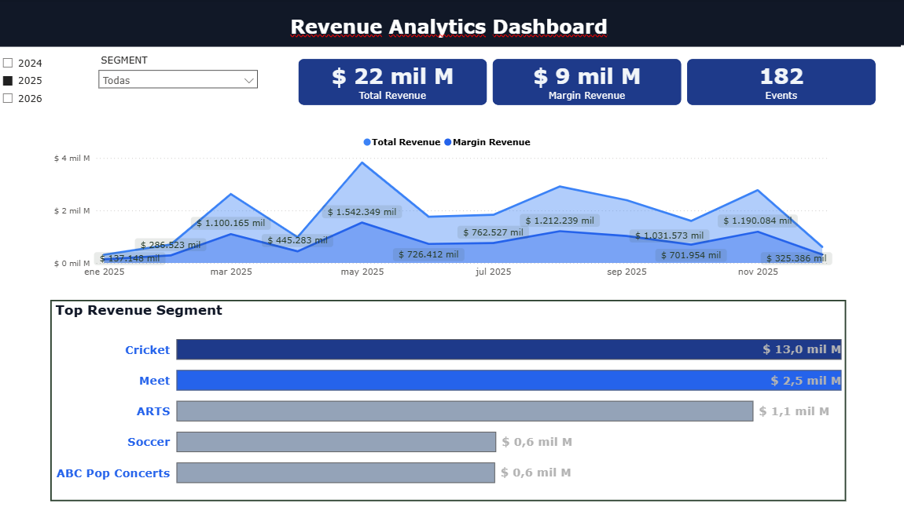
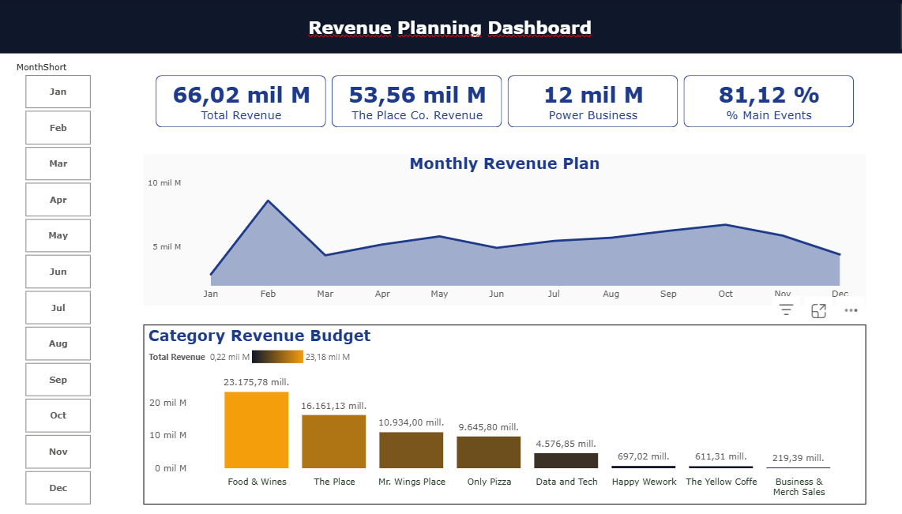

# Gustavo Mendez

Data Analyst | Power BI | SQL | Business Intelligence | Process Automation | Digital Transformation

Welcome to my Data Analytics Portfolio.

This repository showcases dashboards and analytics projects focused on business insights, financial performance and operational analysis.

---

## Skills

Power BI  
SQL  
Data Analysis  
Business Intelligence  
Process Automation  

---

## Power BI Dashboard Projects

Note: All dashboards presented in this portfolio use anonymized or simulated data to protect client confidentiality. Visualizations are representative of the analytical solutions developed.

### Revenue Analytics Dashboard

Business problem  
The organization needed a clear view of revenue generated by events and business units.

Solution  
A Power BI dashboard was developed to track revenue performance, event counts and segment contribution.

Key metrics

Total revenue  
Revenue by segment  
Number of events  
Monthly revenue trend

Tools

Power BI  
Data modeling  
DAX

---

### Budget Analysis Dashboard

Business problem  
Management required visibility of the annual revenue budget and performance by category.

Solution  
A financial dashboard was built to analyze budget allocation, revenue categories and trends.

Key insights

Revenue by category  
Monthly trends  
Business unit contribution

Tools

Power BI  
Financial data modeling  
DAX

---

### Strategic Procurement Dashboard

Business problem  
Procurement teams required better visibility of supplier spending and category distribution.

Solution  
A dashboard was created to monitor supplier performance, category spending and monthly evolution of purchases.

Key metrics

Total procurement spending  
Top suppliers  
Top categories  
Monthly spending evolution

Tools

Power BI  
Data analysis  
Business intelligence

---

### Contract Lifecycle Management (CLM) Implementation – Webdox

Business problem  
The organization lacked a centralized system to manage contracts, approvals and document traceability.

Solution  
Led the implementation of a Contract Lifecycle Management (CLM) platform using Webdox, designing approval workflows and improving document governance.

Key outcomes

Centralized contract repository  
Standardized contract approval workflows  
Improved traceability and document control  
Reduction of manual contract management processes

Tools

Webdox CLM  
Process automation  
Workflow design  
Document management

## Contact

Gustavo Mendez  
WhatsApp: +57 320 566 9298  
Email: gustavo.mendez@nebodata.com
