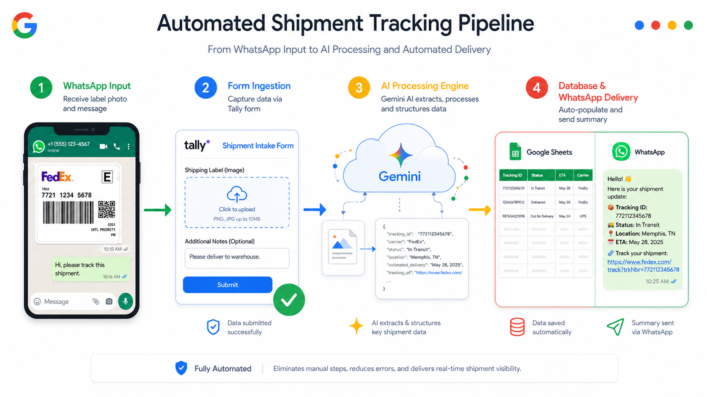

# 📦 AI-Powered Logistics Shipment Tracker & Ingestion Pipeline



## 📌 Executive Summary
An end-to-end automated ETL pipeline designed to solve operational friction in logistics tracking. The system ingests unstructured inputs (WhatsApp screenshots, PDF shipping labels, and vendor emails), processes them using **Gemini 3.6 Flash** for multimodal extraction, logs structured data into a central database, and automatically formats client-ready status updates in English.

---

## 🛠️ Tech Stack & Architecture

* **Ingestion Layer:** Tally Forms (No-code web form for rapid file/text uploads).
* **Database & Storage:** Google Sheets API + Google Drive (Automated row insertion & asset link storage).
* **Processing & Orchestration:** Python, Google Colab, `gspread`, `pydantic`.
* **AI Engine:** Google Gemini API (`gemini-3.6-flash` with Structured Outputs via Pydantic).

---

## 🔄 Workflow Breakdown

1. **Unstructured Data Receipt:** Logistics operational teams receive raw shipping proofs (FedEx, UPS, DHL, etc.) via messaging channels.
2. **Form Ingestion (Tally):** Operators upload image/PDF files or paste raw text using a streamlined, lightweight interface.
3. **Automated Webhook Sync:** Tally syncs submission records directly to Google Sheets in real-time.
4. **Multimodal Data Extraction (Gemini AI):**
   * Python ETL pipeline fetches new file payloads.
   * Gemini 3.6 Flash parses tracking IDs, carrier details, status, origin, destination, piece counts, and ETAs.
   * Enforces strict type validation using Pydantic schemas.
5. **Database Output & Automated Delivery:**
   * Parsed data is appended into `tracking_analytics`.
   * A ready-to-send, professionally formatted WhatsApp message with direct tracking links is generated for the end client.

---

## 🚀 Key Business Impact

* ⏱️ **Near-Zero Data Entry Time:** Eliminates manual typing of complex tracking numbers and addresses.
* 🎯 **100% Data Structuring:** Transforms unstructured screenshots into actionable database rows.
* 💬 **Instant Client Communication:** Standardizes client notification messages in clean English with direct carrier links.
* 💰 **Zero Maintenance Overhead:** Built using a serverless architecture with free-tier enterprise tooling.

---

## 💻 Python ETL Core Logic (Excerpt)

```python
class ShippingData(BaseModel):
    tracking_number: str = Field(description="Master Tracking ID or PRO Number")
    carrier: str = Field(description="Carrier name: FedEx, UPS, DHL, etc.")
    status: str = Field(description="Normalized status: LABEL_CREATED, IN_TRANSIT, DELIVERED")
    estimated_delivery: str = Field(description="YYYY-MM-DD format", default="N/A")
    client_whatsapp_message: str = Field(description="Formatted client message in English with emojis and tracking URL")

# Gemini Multimodal API Call with Structured Output
response = client.models.generate_content(
    model="gemini-3.6-flash",
    contents=[types.Part.from_bytes(data=file_bytes, mime_type=mime_type), prompt],
    config=types.GenerateContentConfig(
        response_mime_type="application/json",
        response_schema=ShippingData,
        temperature=0.1
    )
)